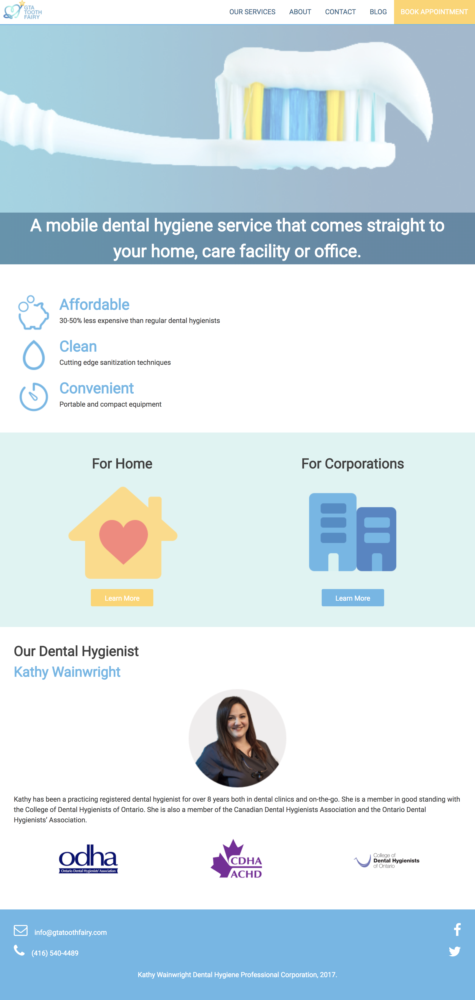
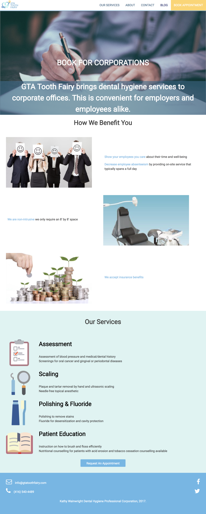

# GTA Tooth Fairy

Custom WordPress theme

<h3>ASK:</h3> 

In collaboration with UI/UX team, build a WordPress theme for a client wishing to re-vamp their website and make it more user-friendly.

<h3>FINISHED PRODUCT:</h3> 
 Used PHP to build Wordpress theme in a team environment. Research was done to ensure the best-suited plugins were used. Group performance was optimized by using Git for version control and collaboration. I was given the role of Client Lead which included additional duties of being in constant communication with the client and presenting the final product.

